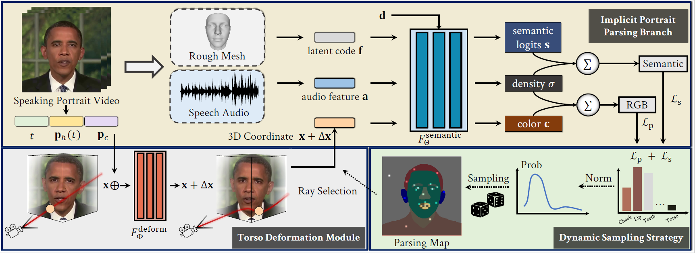

# Semantic-Aware Implicit Neural Audio-Driven Video Portrait Generation (ECCV 2022 Oral)

[Xian Liu](https://alvinliu0.github.io/), [Yinghao Xu](https://justimyhxu.github.io/), [Qianyi Wu](https://wuqianyi.top/), [Hang Zhou](https://hangz-nju-cuhk.github.io/), [Wayne Wu](https://wywu.github.io/), [Bolei Zhou](http://bzhou.ie.cuhk.edu.hk/).

### [Project](https://alvinliu0.github.io/projects/SSP-NeRF) | [Paper](https://arxiv.org/pdf/2201.07786.pdf) | [Demo](https://www.youtube.com/watch?v=M7BvPzIBgfM)

Animating high-fidelity video portrait with speech audio is crucial for virtual reality and digital entertainment. While most previous studies rely on accurate explicit structural information, recent works explore the implicit scene representation of Neural Radiance Fields (NeRF) for realistic generation. In order to capture the inconsistent motions as well as the semantic difference between human head and torso, some work models them via two individual sets of NeRF, leading to unnatural results. In this work, we propose Semantic-aware Speaking Portrait NeRF (SSP-NeRF), which creates delicate audio-driven portraits using one unified set of NeRF. The proposed model can handle the detailed local facial semantics and the global head-torso relationship through two semantic-aware modules. Specifically, we first propose a Semantic-Aware Dynamic Ray Sampling module with an additional parsing branch that facilitates audio-driven volume rendering. Moreover, to enable portrait rendering in one unified neural radiance field, a Torso Deformation module is designed to stabilize the large-scale non-rigid torso motions. Extensive evaluations demonstrate that our proposed approach renders realistic video portraits.



## Environment and Pre-requisites

This project is developed and tested on Ubuntu 18.04, Python 3.7, PyTorch 1.9.1 and CUDA version: 11.1. Since the repository is developed based on [AD-NeRF](https://github.com/YudongGuo/AD-NeRF) of Guo et al., the environment installation and some pre-requisites like PyTorch3D, 3DMM basis params generally follow theirs.

- You can create an anaconda environment called sspnerf with:
    ```
    conda env create -f environment.yml
    conda activate sspnerf
    ```
- [PyTorch3D](https://github.com/facebookresearch/pytorch3d)

    Recommend install from a local clone
    ```
    git clone https://github.com/facebookresearch/pytorch3d.git
    cd pytorch3d && pip install -e .
    ```
    Note: The PyTorch3D is only used for dataset pre-processing at a single step and it is not involved in the later training process. If you find the original environment contradicts to the requirements of PyTorch3D, you could create a separate conda env for PyTorch3D and activate it when implementing the corresponding dataset pre-processing step and shift back to the original environment.
- [Basel Face Model 2009](https://faces.dmi.unibas.ch/bfm/main.php?nav=1-1-0&id=details) 

    Put "01_MorphableModel.mat" to data_util/face_tracking/3DMM/; cd data_util/face_tracking; run
    ```
    python convert_BFM.py
- [spconv](https://github.com/traveller59/spconv) 

    Recommend install via below command
    ```
    git clone https://github.com/traveller59/spconv --recursive
    cd spconv
    git checkout abf0acf30f5526ea93e687e3f424f62d9cd8313a
    git submodule update --init --recursive
    export CUDA_HOME="/usr/local/cuda-11.1"
    python setup.py bdist_wheel
    cd dist
    pip install spconv-1.2.1-cp36-cp36m-linux_x86_64.whl
    ```

## Dataset Preparation and Pre-processing

### Dataset Download and Preparation

Due to the YouTube video copyright issues, we could not provide the raw videos/frames. The YouTube video ID of each corresponding videos are provided in `video_id.txt`. You could download them by efficient tools like [youtube-dl](https://youtube-dl.org/). Afterwards, you could select the clips of interest (the clips with clear talking face of a certain speaker), and then crop the images into square shape for later pre-processing (i.e., keep the head, torso and background parts remained).

### Data Pre-processing

The data pre-processing codes are included in the `data_util` folder, where the main pre-processing calling scripts are in the `data_util/process_data.py`. To implement it step by step, you could run the below bash command:

```
bash process_data.sh $person_name$
```

The additional features are that we parse the more detailed facial regions as well as save the 3DMM facial keypoints.

## Training

Since the work is done during internship at SenseTime Research, part of the codes still need to undergo a series of review and permission process.

## Citation

If you find our work useful, please kindly cite as:
```
@article{liu2022semantic,
  title = {Semantic-Aware Implicit Neural Audio-Driven Video Portrait Generation},
  author = {Liu, Xian and Xu, Yinghao and Wu, Qianyi and Zhou, Hang and Wu, Wayne and Zhou, Bolei},
  journal={arXiv preprint arXiv:2201.07786},
  year = {2022}
}
```

## Related Projects

If you are interested in **NeRF / neural implicit representions + semantic map**, we would also like to recommend you to check out other related works:

* Object-compositional implicit neural surfaces: [ECCV 2022] [ObjectSDF](https://qianyiwu.github.io/objectsdf).

* Neural implicit generative model: [ECCV 2022] [Sem2NeRF](https://donydchen.github.io/sem2nerf/).

## Acknowledgement
* The codebase is developed based on [AD-NeRF](https://github.com/YudongGuo/AD-NeRF) of Guo et al. Many thanks to their great contributions!